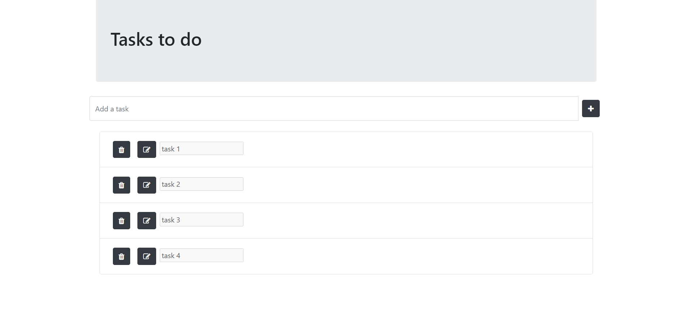
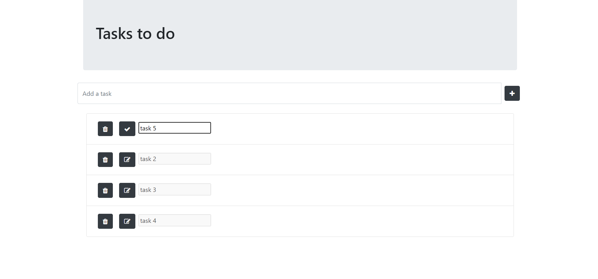
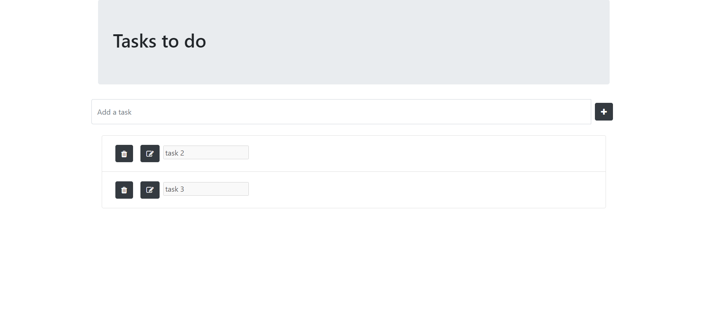

# Task To Do Using React Redux

### User can add, delete and modify tasks to do.

click the link below to check the repository : [Github Repository Link](https://github.com/kirti18patel/todoredux)

## Usage

  > cd todo-redux

  > npm i
  
  > npm start

  or
  
  > yarn build

## Preview

